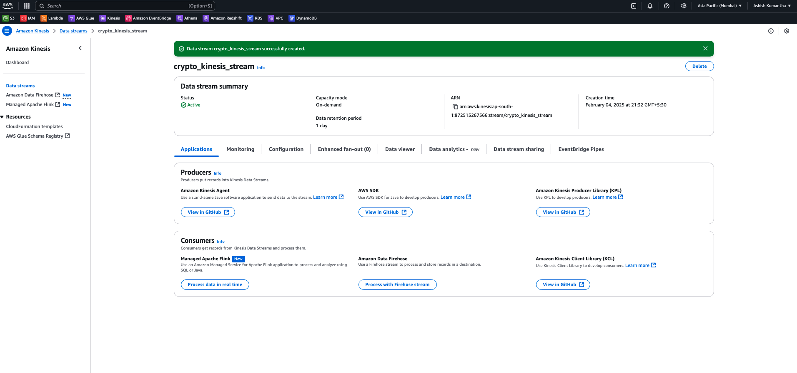

# Crypto Data Analysis Near Realtime Data Pipeline 

## Project Overview
This project implements a near-realtime data pipeline for analyzing cryptocurrency data. The pipeline ingests Change Data Capture (CDC) data from a DynamoDB table, processes it through AWS Kinesis and Firehose, and lands the data in AWS S3. AWS Glue, along with Apache Hudi, is used for performing upsert operations on the dataset, which can then be queried using AWS Athena and visualized in AWS QuickSight. The solution leverages AWS Glue Crawlers and Triggers to automate the process, ensuring that the pipeline runs at regular intervals (every 15 minutes).

## Tech Stack
- **Programming Language:** Python
- **Database:** AWS DynamoDB
- **Streaming:** AWS Kinesis Data Streams
- **Ingestion & Transformation:** AWS Data Firehose, AWS Lambda (for transformation)
- **Storage:** AWS S3
- **ETL & Data Cataloging:** AWS Glue, AWS Glue Crawler, AWS Glue Catalog, AWS Glue Triggers
- **Upsert Operations & Data Management:** Apache Hudi
- **Querying:** AWS Athena
- **Visualization:** AWS QuickSight

## High-Level Architecture
1. **Data Source & CDC:** A DynamoDB table is set up to store crypto data. Change Data Capture (CDC) is enabled on the table, and a corresponding Kinesis Data Stream is configured to capture the changes.
2. **Data Processing & Transformation:** The CDC data flows into Kinesis, where an AWS Lambda function transforms the incoming records. The processed records are then delivered via AWS Data Firehose into an S3 bucket in JSON format.
3. **Data Cataloging & ETL:** An AWS Glue Crawler periodically scans the S3 bucket to create/update table metadata in the AWS Glue Catalog. An AWS Glue ETL job then reads the data, performs necessary transformations, and executes upsert operations on Apache Hudi tables.
4. **Orchestration & Scheduling:** AWS Glue Triggers are configured to run the Glue Crawler and ETL job in sequence every 15 minutes, ensuring that the data remains near realtime.
5. **Query & Visualization:** The processed data in Apache Hudi is accessible via AWS Athena for ad hoc queries and integrated with AWS QuickSight for visualization and analysis.

## Detailed Step-by-Step Implementation

### 1. Setup DynamoDB Table & Kinesis Data Stream
#### DynamoDB Table:
- **Objective:** Store crypto-related data (e.g., transactions, orders, price updates).
- **Steps:**
  1. **Create a DynamoDB Table:** Use the AWS Console, CLI, or CloudFormation. Define the primary key (partition key and, if needed, sort key) based on your data model.
  2. **Provision Capacity:** Choose between on-demand or provisioned throughput based on expected write/read volumes.
  3. **Design Considerations:** Optimize the table schema for efficient querying and consider secondary indexes if necessary.
Table image 

Table data demo

#### Kinesis Data Stream:
- **Objective:** Capture change events (insert, update, delete) from DynamoDB.
- **Steps:**
  1. **Create a Kinesis Data Stream:** Navigate to the AWS Kinesis console and create a stream with an appropriate number of shards to handle the CDC event volume.
  2. **Integrate with DynamoDB:** This stream will be used to capture CDC events when enabled on the DynamoDB table.
Kinesis Data Stream

### 2. Enable CDC Stream & Kinesis Stream on DynamoDB
#### Enabling CDC (Change Data Capture):
- **Objective:** Stream all changes in the DynamoDB table.
- **Steps:**
  1. **Enable DynamoDB Streams:** In the DynamoDB table settings, enable streams and choose the view type (e.g., NEW_IMAGE, OLD_IMAGE, or NEW_AND_OLD_IMAGES) based on what information is required for processing.
  2. **Configure Kinesis Integration:** Set up the stream so that the DynamoDB CDC events are published to the Kinesis Data Stream you created earlier.
- **Considerations:** Ensure that your IAM roles and policies allow DynamoDB to write to Kinesis and that your stream’s retention period aligns with your processing requirements.

### 3. Setup AWS Data Firehose with AWS Lambda Transformer to Sync Processed CDC Data from Kinesis to AWS S3
#### AWS Data Firehose:
- **Objective:** Ingest the transformed CDC data into S3.
- **Steps:**
  1. **Create a Delivery Stream:** In the AWS Kinesis Data Firehose console, create a new delivery stream with S3 as the destination.
  2. **Configure Buffering & Compression:** Set the buffering hints (size and time) to control when data is delivered to S3. Enable data compression (e.g., GZIP) for cost and performance benefits.


#### AWS Lambda Transformer:
- **Objective:** Process and transform CDC data on-the-fly before it is stored in S3.
- **Steps:**
  1. **Create a Lambda Function:** Write a Python-based Lambda function that accepts records from the Firehose stream, processes or enriches the data, and returns the transformed data.
  2. **Integrate with Firehose:** Configure the Firehose delivery stream to use your Lambda function as a data transformer. This function can filter, reformat, or add additional attributes to your CDC records.
  3. **Testing & Monitoring:** Test the Lambda function with sample data to ensure it processes the records correctly, and monitor its performance using CloudWatch Logs.

#### real code file -> [code](./lambda_transformer.py) 
### 4. Create AWS Glue Crawler to Create Table in AWS Glue Catalog for Underlying JSON Data in AWS S3
#### AWS Glue Crawler:
- **Objective:** Automatically infer schema and create/update metadata in the AWS Glue Catalog for the JSON data stored in S3.
- **Steps:**
  1. **Create a Crawler:** In the AWS Glue Console, create a new crawler.
  2. **Define Data Store:** Point the crawler to the S3 bucket/folder where the transformed CDC data is stored.
  3. **Set Output Database:** Choose or create a Glue database where the table metadata will reside.
  4. **Run the Crawler:** Execute the crawler to populate the Glue Catalog with table definitions that reflect the underlying JSON structure.
- **Considerations:** Schedule the crawler to run periodically or trigger it as part of the workflow so that new or updated data schemas are captured.

### 5. Create AWS Glue Job to Process the Data and Perform Upsert Operation on Hudi Tables
#### AWS Glue Job:
- **Objective:** Process ingested data and perform upsert (insert/update) operations on Apache Hudi tables.
- **Steps:**
  1. **Develop the ETL Script:** Write a Python (PySpark) script that:
     - Reads data from the Glue Catalog (the table created by the crawler).
     - Applies any necessary transformations, cleans, and normalizes the data.
     - Uses the Apache Hudi library to perform upsert operations on the target Hudi table stored in S3.
  2. **Configure Job Parameters:**
     - Enable job bookmarks if needed to track processed data.
     - Set appropriate Spark configurations for Hudi (e.g., commit interval, write options).
  
  3. **Create the Job:** In the AWS Glue Console, create a new job and attach your script.
  4. **Testing & Validation:** Run the job manually to verify that data is correctly upserted into the Hudi table, and validate by querying the table using AWS Athena.
- **Sample Pseudocode Outline:**
  ```python
  from pyspark.sql import SparkSession
  from pyspark.sql.functions import *
  from hudi import HudiWriter  # Pseudocode, ensure Hudi dependencies are included

  spark = SparkSession.builder.appName("CryptoDataUpsert").getOrCreate()

  # Read data from S3 using the Glue Catalog table
  df = spark.read.format("json").table("crypto_cdc_data")

  # Perform data transformation
  transformed_df = df.withColumn("processed_timestamp", current_timestamp())

  # Configure Hudi upsert options
  hudi_options = {
      "hoodie.table.name": "crypto_hudi_table",
      "hoodie.datasource.write.recordkey.field": "unique_id",
      "hoodie.datasource.write.precombine.field": "timestamp",
      "hoodie.upsert.shuffle.parallelism": 2,
      # additional Hudi configurations
  }

  # Write/upsert data into the Hudi table on S3
  transformed_df.write.format("hudi").options(**hudi_options).mode("append").save("s3://crypto-data/hudi/crypto_hudi_table")

#### real code file -> [code](./crypto_nrt_etl_glue_job.py)

### 6. Create Glue Triggers to Run Crawler and Glue Job in Sequence Every 15 Minutes
#### AWS Glue Triggers:
- **Objective:** Automate the workflow by sequentially running the crawler and the Glue job every 15 minutes.
- **Steps:**
  1. **Create a Time-Based Trigger for the Crawler:**
     - In the AWS Glue Console, create a trigger that runs on a schedule (every 15 minutes).
     - Set the trigger to start the Glue Crawler that updates the Glue Catalog.
  2. **Create a Dependent Trigger for the Glue Job:**
     - Create a second trigger that depends on the successful completion of the crawler.
     - Configure this trigger to start the Glue job that processes data and performs upsert operations on the Hudi table.
  3. **Sequence Execution:**
     - Ensure that the triggers are linked so that once the crawler finishes, the Glue job is automatically invoked.
     - Test the triggers to confirm that the sequence executes correctly and that any failures are reported via CloudWatch or SNS notifications.
- **Considerations:** Use AWS Glue’s built-in scheduling capabilities or integrate with AWS EventBridge for more complex scheduling scenarios.

## Querying and Visualization
- **AWS Athena:** Use Athena to query the Hudi table stored in S3. Ensure that the Hudi table is properly cataloged in the Glue Catalog so that Athena can read the data seamlessly.
- **AWS QuickSight:** Connect QuickSight to Athena to create dashboards and visualizations that provide insights into the crypto data analysis pipeline.

## Monitoring & Logging
- **CloudWatch:** Monitor logs for AWS Lambda, Glue jobs, and DynamoDB Streams. Set up alarms for job failures and performance issues.
- **Glue Job Metrics:** Review job metrics in AWS Glue to track processing times and success rates.
- **Hudi Commit Logs:** Monitor Hudi commit logs for insight into the upsert operations.

## Conclusion
This near-realtime data pipeline for crypto data analysis efficiently ingests CDC data from DynamoDB, processes it through multiple AWS services, and updates an Apache Hudi table. With automated scheduling via AWS Glue Triggers, the pipeline continuously processes new data every 15 minutes, providing near realtime insights that can be queried with Athena and visualized using QuickSight.

<!-- ## References
- [AWS DynamoDB Documentation](https://docs.aws.amazon.com/amazondynamodb/latest/developerguide/Introduction.html)
- [AWS Kinesis Data Streams Documentation](https://docs.aws.amazon.com/streams/latest/dev/introduction.html)
- [AWS Data Firehose Documentation](https://docs.aws.amazon.com/firehose/latest/dev/what-is-this-service.html)
- [AWS Lambda Documentation](https://docs.aws.amazon.com/lambda/latest/dg/welcome.html)
- [AWS Glue Documentation](https://docs.aws.amazon.com/glue/latest/dg/what-is-glue.html)
- [Apache Hudi Documentation](https://hudi.apache.org/docs/overview)
- [AWS Athena Documentation](https://docs.aws.amazon.com/athena/latest/ug/what-is.html)
- [AWS QuickSight Documentation](https://docs.aws.amazon.com/quicksight/latest/user/welcome.html) -->
```


